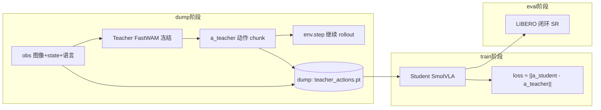

# FastWAM → 小 VLA 动作蒸馏：概念讲清楚

> 对照本仓库实现：`lerobot_alohamini/examples/alohamini/fastwam_distill/`  
> 目标：搞懂 **rollout / dump / teacher / student / distill loss**，并能对着代码讲面试。

---

## 0. 一句话在干什么

```text
冻住大模型 FastWAM（teacher）
    → 在 LIBERO 里 rollout，收集 (观测 → teacher 动作)
    → dump 成 teacher_actions.pt
    → 小模型 SmolVLA（student）学这些动作
    → 再在 LIBERO 上测 success rate (SR)
```

这叫 **action distillation（动作蒸馏）**：不蒸像素/未来视频，只让小模型模仿大模型的动作输出。

---

## 1. 名词对照表

| 词 | 含义 | 在本项目里是谁 |
|----|------|----------------|
| **Teacher** | 被模仿的强模型，**冻结、不反传** | 官方 FastWAM `libero_uncond_2cam224.pt` |
| **Student** | 要训的小模型 | `lerobot/smolvla_base`（SmolVLA） |
| **Rollout** | 在仿真里「看→动→再看」闭环跑 episode | `dump_teacher_env.py` 里 `env.step` |
| **Dump** | 把 teacher 产生的 `(obs, a)` 存盘 | `teacher_actions.pt` |
| **Distill** | 用 teacher 动作当标签训 student | `train_distill.py` |
| **SR** | 闭环任务成功率 | `3_eval_sr.sh` → `pc_success` |



---

## 2. Teacher：冻住的大模型

### 2.1 角色

- 输入：当前多相机图像 + proprio + 任务语言  
- 输出：一段未来动作 **chunk**（本项目 horizon≈32，维度 7：eef 6D + gripper）  
- **不训练**：只 `eval()` + `torch.no_grad()` 推理

### 2.2 本项目怎么加载

`official_teacher.py` → `load_official_teacher()`：

- 用官方 FastWAM 包（conda：`fastwam_official`）
- 本地 DiffSynth Wan VAE / T5（`DIFFSYNTH_SKIP_DOWNLOAD=true`）
- ckpt：`/home/july/FastWAM/checkpoints/fastwam_release/libero_uncond_2cam224.pt`

核心推理（概念代码）：

```python
# official_teacher.predict_env_action_chunk
with torch.no_grad():
    pred = teacher.model.infer_action(
        prompt=prompt,
        input_image=image,      # 双相机拼接后的图
        action_horizon=32,
        proprio=proprio,
        num_inference_steps=10,
    )
action = pred["action"]           # 归一化空间
action = denormalize(action)      # → 环境可执行的 env-space
action = invert_gripper(action)   # 对齐 LIBERO gripper 符号
# action.shape == [H, 7]
```

**面试一句：** Teacher 是冻结的 FastWAM；推理只做当前帧编码 + action flow-matching，不做 test-time 未来视频生成。

---

## 3. Rollout：在环境里闭环跑

### 3.1 什么是 rollout

一次 **episode** 大致是：

```text
reset 环境 → 得到 obs_0
loop:
    根据 obs_t 得到动作 a_t（或一段 chunk）
    env.step(a_t) → obs_{t+1}, reward, done
直到成功/失败/超时
```

Teacher dump 时，动作用 **FastWAM 自己推**（不是随机、也不是数据集 GT）。

### 3.2 本项目里的 rollout（dump_teacher_env.py）

```python
env, task_description = get_libero_env(task, resolution, seed)
obs = env.set_init_state(init)

while step < max_steps:
    if action_queue 空了:
        chunk = predict_env_action_chunk(teacher, obs, task_description)  # [H,7]
        # 每隔 stride 步，把当前 (obs, chunk) dump 下来
        if step % stride == 0:
            save_sample(obs, chunk)
        # 只执行 chunk 的前 replan_steps 步（默认 10），再重新推理
        action_queue.extend(chunk[:replan_steps])

    a = action_queue.pop(0)
    obs, reward, done, info = env.step(a.tolist())
```

关键旋钮：

| 参数 | 含义 |
|------|------|
| `episodes` | 跑几条 episode |
| `stride` | 每隔多少 env step 存一条 distill 样本 |
| `replan_steps` | 每次推理执行几步再重新问 teacher |

**Rollout ≠ Dump：**  
Rollout 是「在环境里动起来」；Dump 是「把中间产生的 (obs, a_teacher) 存下来」。

---

## 4. Dump：存成可训练的数据

### 4.1 存什么

文件：`outputs/fastwam_distill/teacher_dump/teacher_actions.pt`

```python
payload = {
    "format": "env_rollout",
    "actions": Tensor[N, H, 7],   # env-space teacher 动作
    "images": [ { "observation.images.image": CHW,
                  "observation.images.image2": CHW }, ... ],
    "states": [ state_tensor or None, ... ],
    "tasks":  [ "pick up the black bowl ...", ... ],
    "indices": arange(N),
}
```

一条样本 = **某一时刻的观测 + teacher 给出的整段动作 chunk**。

### 4.2 两种 dump 方式

| 脚本 | 数据从哪来 | 何时用 |
|------|------------|--------|
| `dump_teacher_env.py`（推荐） | LIBERO **仿真 rollout** | 不依赖 HF 视频是否下全 |
| `dump_teacher_actions.py` | 本地 LIBERO **数据集帧** | snapshot 有完整 `videos/` 时 |

### 4.3 为什么动作要 env-space

Teacher 内部是归一化动作；dump 前会 **denormalize**。  
Student 训练时再走自己的 preprocessor 归一化。  
这样 teacher / student 的 norm 统计可以不同，契约统一在「环境动作空间」。

---

## 5. Student：要训的小 VLA

### 5.1 角色

- 初始化：`lerobot/smolvla_base`（比 FastWAM 小得多）
- 输入：同样的图像 / state / 语言（来自 dump）
- 标签：**不是** 人工演示 GT，而是 **`a_teacher`**
- 训练完后：自己上 LIBERO 闭环，测 SR

### 5.2 数据怎么喂（train_distill.py）

```python
class EnvRolloutDataset(Dataset):
    def __getitem__(self, i):
        item = {}
        item.update(self.images[i])          # 相机
        if self.states[i] is not None:
            item["observation.state"] = self.states[i]
        item["action"] = pad(self.actions[i], chunk_size)  # ← teacher 动作当标签
        item["task"] = self.tasks[i]
        return item
```

---

## 6. Distill loss：蒸馏到底优化什么

### 6.1 概念公式（动作蒸馏）

最朴素的行为克隆 / 蒸馏：

\[
\mathcal{L}_{\text{distill}}
= \big\| a_{\text{student}}(o) - a_{\text{teacher}}(o) \big\|_2^2
\]

本项目 **没有手写单独的 distill loss 层**，而是：

1. 把 batch 里的 `action` **换成 teacher 动作**  
2. 调用 student 自己的 `policy.forward(batch)`  
3. 用 student 原有训练目标（SmolVLA 内部一般是对 action chunk 的回归 / flow 类损失）去拟合这个伪标签

等价于：

\[
\mathcal{L}
= \mathcal{L}_{\text{student-native}}\big(a_{\text{pred}},\; a_{\text{teacher}}\big)
\]

### 6.2 训练循环（精简版）

```python
# train_distill.py 核心
batch = preprocessor(batch)          # 图像/动作归一化等
loss, loss_dict = policy.forward(batch)  # student 原生 loss，标签已是 teacher
loss.backward()
optim.step()
```

### 6.3 和「在线蒸馏」的区别

| | 本项目（离线 dump） | 在线蒸馏 |
|--|-------------------|----------|
| Teacher 何时跑 | 先 dump，再 train | 每个 train step 都跑 teacher |
| GPU | dump / train **错开**，省显存 | teacher+student 同卡，易 OOM |
| 实现 | `1_dump` → `2_train` | 一个 loop 里两次 forward |

FastWAM ~6B，所以选 **离线 dump** 更现实。

### 6.4 可选加强（本 MVP 未做，面试可提）

```text
L = L_act(student, teacher)
  + α * L_act(student, GT)          # 混一点真标签
  + β * ||z_student - z_teacher||   # 表征蒸馏（世界 latent）
```

---

## 7. 整条流水线对应文件

```text
examples/alohamini/fastwam_distill/
├── local_assets.py          # 本地 ckpt / Wan / LIBERO 路径，强制离线
├── official_teacher.py      # 加载冻结 FastWAM + infer_action
├── dump_teacher_env.py      # rollout + dump（推荐）
├── dump_teacher_actions.py  # 从数据集帧 dump（需 videos/）
├── train_distill.py         # student 训在 teacher 动作上
├── 1_dump_env.sh / 2_train.sh / 3_eval_sr.sh
├── run_fast_sr.sh           # 快速出 SR（求职用）
└── README.md
```

运行顺序：

```bash
bash 1_dump_env.sh    # Teacher rollout → teacher_actions.pt
bash 2_train.sh       # Student 学 teacher 动作
bash 3_eval_sr.sh     # Student 闭环 → pc_success
```

---

## 8. 最小可背代码块（面试）

### 8.1 Dump 伪代码

```python
teacher.eval()
for episode in range(E):
    obs = env.reset()
    while not done:
        with torch.no_grad():
            a_chunk = teacher.infer_action(obs, task)   # [H, D]
        if should_dump:
            buffer.append({"obs": obs, "action": a_chunk})
        obs, _, done, _ = env.step(a_chunk[0])          # 或执行多步再 replan
torch.save(buffer, "teacher_actions.pt")
```

### 8.2 Distill 伪代码

```python
student.train()
for batch in loader:  # batch["action"] 已是 a_teacher
    batch = preprocessor(batch)
    loss, _ = student.forward(batch)   # 原生 BC / FM loss
    loss.backward(); optim.step()
```

### 8.3 和「普通模仿学习」差在哪

| | 普通 BC | 本蒸馏 |
|--|---------|--------|
| 标签来源 | 人类 / 数据集 GT | **Teacher 策略输出** |
| 数据分布 | 演示分布 | 更接近 teacher 在环境中的 **状态分布**（若用 rollout dump） |
| 目的 | 学演示 | 把大模型能力 **压到小模型** |

---

## 9. 和 FastWAM 论文设定的关系

| FastWAM 论文点 | 蒸馏里怎么用 |
|----------------|--------------|
| 训练时有 video co-training | Teacher **已经**用视频目标训好了 |
| 推理不做 future imagination | Dump 时用 `infer_action`，只出动作 |
| 大、慢 | 正是要蒸馏到 SmolVLA 的原因 |

**面试金句：**  
「我冻住官方 FastWAM 当 teacher，在 LIBERO 上 rollout dump 动作 chunk，再用 SmolVLA 做离线动作蒸馏，最后用闭环 SR 验证；这是 action-level distillation，不是蒸未来视频。」

---

## 10. 求职时数字怎么说

1. **主结果（已有）：** 官方 FastWAM 权重复现 LIBERO 2000 ep，Overall **97.1%**  
2. **蒸馏 MVP：** FastWAM→SmolVLA 管线 + 测到的 student `pc_success=X%`（小预算）  
3. **工程点：** 本地 DiffSynth Wan、离线 dump 省显存、双重归一化排错过 LeRobot 路径  

不要写：蒸馏达到 SOTA / 超过 FastWAM。

---

## 11. 自测问题（学完能答）

1. Rollout 和 Dump 各发生在哪一步？  
2. 为什么 dump 要用 env-space 动作？  
3. 本项目的 distill loss 是单独写的还是复用 student.forward？  
4. 为什么选离线 dump 而不是在线蒸馏？  
5. `stride` / `replan_steps` / `action_horizon` 分别控制什么？

答得上来，这条项目经历就能讲圆。
